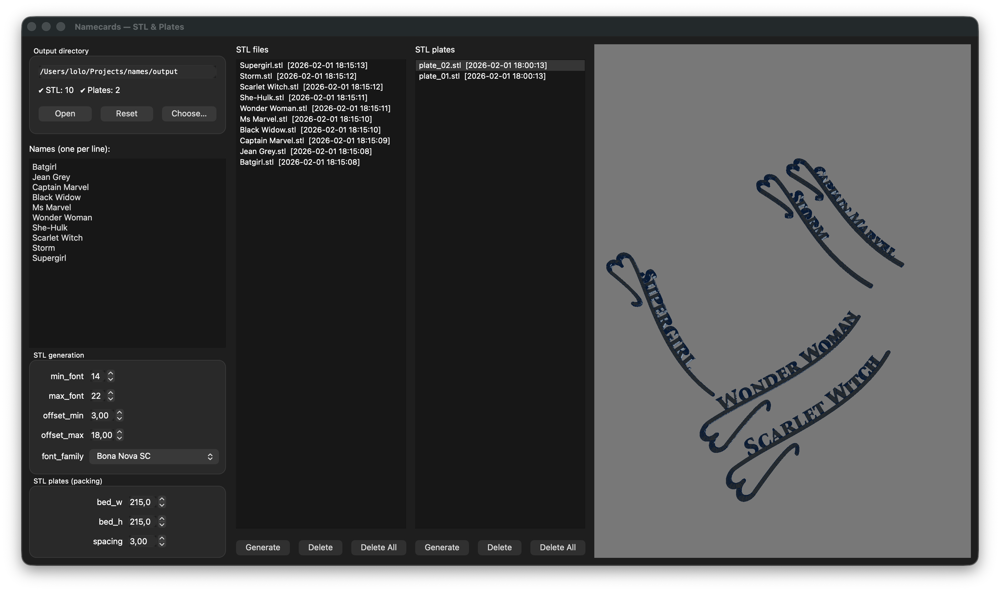

# Namecards

Namecards is an open-source desktop application to generate and pack 3D STL nameplates  
from a list of names, with a live OpenGL preview.

It is designed for **3D printing**, **laser engraving**, and **CNC workflows**.

---

## Features

- Generate individual STL nameplates from a list of names  
- Live 3D preview using OpenGL  
- Batch STL generation  
- Automatic plate packing for 3D printers  
- Configurable font and layout parameters  
- Multiple output directories  
- Cross-platform GUI (macOS and Windows)

---

## Supported platforms

- macOS (Intel and Apple Silicon)  
- Windows (64-bit)

Linux may work but is not officially supported.

---

## Installation (Users)

Download the latest release from the GitHub Releases page:

    https://github.com/lpauloin/Namecards/releases

Available builds:
- macOS: Namecards-macos.zip  
- Windows: Namecards-windows.zip  

No Python installation is required.

---

## Required external tools (MANDATORY)

Namecards relies on external command-line tools that **must be installed before running the application**.

---

## OpenSCAD (required)

Used to generate STL geometry.

Website:

    https://openscad.org

The `openscad` command must be available in your PATH.

### macOS

1. Download the DMG  
2. Drag OpenSCAD to `/Applications`  
3. Launch OpenSCAD once manually (Gatekeeper requirement)

Verify installation:

    openscad --version

### Windows

1. Download the Windows installer from https://openscad.org  
2. Install using the default options  
3. Make sure **"Add OpenSCAD to PATH"** is enabled during installation  
4. Restart your computer if needed

Verify installation:

    openscad --version

---

## Inkscape (required)

Used to convert SVG text into vector paths.

Website:

    https://inkscape.org

The `inkscape` command must be available in your PATH.

### macOS

1. Download the DMG  
2. Drag Inkscape to `/Applications`  
3. Launch Inkscape once manually

Verify installation:

    inkscape --version

### Windows

1. Download the Windows installer from https://inkscape.org  
2. Install using the default options  
3. Enable **"Add Inkscape to PATH"** if available  
4. Restart your computer if needed

Verify installation:

    inkscape --version

---

## Usage

Launch the application by double-clicking **Namecards**.

---

## Output directory

By default, files are generated in:

    ./output

You can change this using **Choose OUTDIR** inside the application.

Generated folders:

    output/
      stl/        individual STL nameplates
      plate/      packed printer plates

---

## Generate STL nameplates

1. Enter one name per line  
2. Adjust STL parameters if needed  
3. Click **Generate** under **STL files**

Each name produces one STL file.

---

## Preview STL files

- Click any STL file in the list  
- The 3D preview updates instantly  
- You can rotate, zoom, and inspect the model  

---

## Generate STL plates (packing)

1. Adjust printer bed size and spacing if needed  
2. Click **Generate** under **STL plates**

The application automatically packs multiple nameplates onto printable plates.

---

## Troubleshooting

### OpenSCAD or Inkscape not found

- Make sure OpenSCAD and Inkscape are installed  
- Make sure their command-line tools are available in your PATH  
- Restart the application after installation  

Test manually:

    openscad --version
    inkscape --version

---

### Black or empty 3D preview (Windows)

- Update your GPU drivers  
- Make sure your GPU supports OpenGL 2.1 or higher  
- Desktop OpenGL is enforced by the application  

---

## Output structure

    output/
      stl/
        Alice.stl
        Bob.stl
      plate/
        plate_01.stl
        plate_02.stl

---

## Build from source (Developers)

### Requirements

- Python 3.10 or newer  
- OpenSCAD  
- Inkscape  

Install Python dependencies:

    pip install -r requirements.txt

---

## Build standalone binaries (PyInstaller)

### Common steps

1. Create and activate a virtual environment  
2. Install dependencies and PyInstaller  
3. Run PyInstaller using the provided spec file  

---

### macOS build instructions

1. Install Python 3.10+ (python.org or Homebrew)
2. Create a virtual environment:

    python3 -m venv venv
    source venv/bin/activate

3. Install dependencies:

    pip install -r requirements.txt

4. Build the application:

    pyinstaller Namecards.spec

5. The application bundle will be created in:

    dist/Namecards.app

Note:
- You must build on macOS to produce a macOS binary
- For universal builds, separate Intel and Apple Silicon builds are required

---

### Windows build instructions

1. Install Python 3.10+ (64-bit) from python.org  
   Make sure **"Add Python to PATH"** is checked

2. Create a virtual environment:

    python -m venv venv
    venv\Scripts\activate

3. Install dependencies:

    pip install -r requirements.txt
    pip install pyinstaller

4. Build the application:

    pyinstaller Namecards.spec

5. The executable will be created in:

    dist\Namecards\Namecards.exe

Note:
- You must build on Windows to produce a Windows binary
- Test on a machine without Python installed

---

## License

This project is licensed under the **MIT License**.

You are free to use, modify, and redistribute it.

---

## Contributing

Pull requests are welcome.

Please:

- keep the code clean and readable  
- test on macOS or Windows  
- avoid platform-specific hacks  

---

## Credits

Built with:

- Python  
- PySide6 (Qt)  
- pyqtgraph  
- trimesh  
- OpenSCAD  
- Inkscape